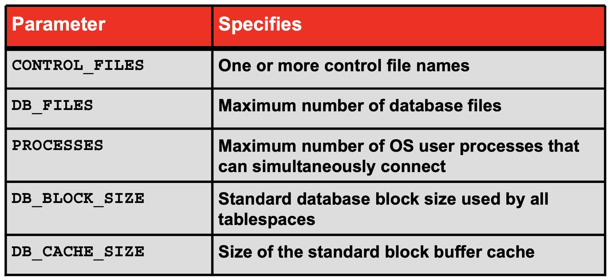
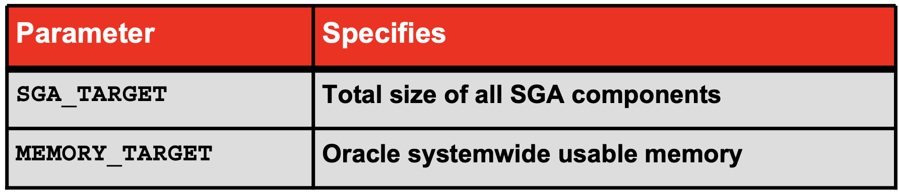
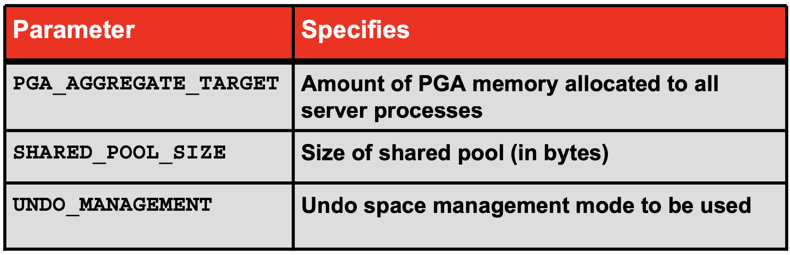
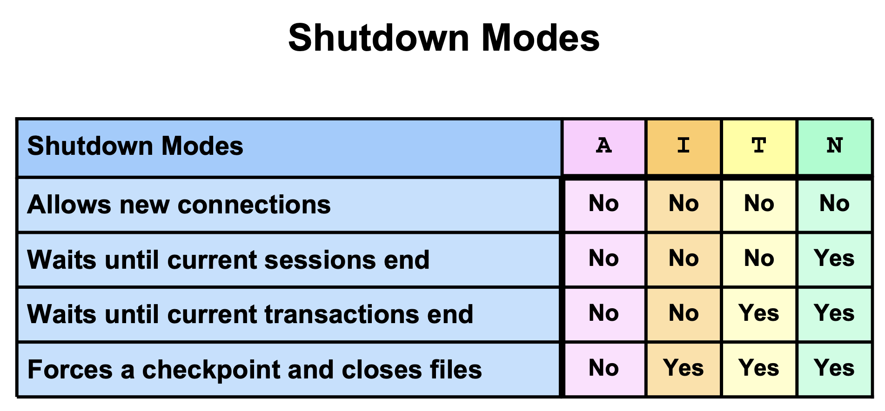

# Первая лекция
Физическое хранилище данных - файлы.  
Логическое хранилище - табличное пространство - группа файлов
На сервере - БД и инстансы.  
База данных: файлы данных.  
файлы управления - о завершениях транзакций, о расположении файлов данных и повторов, без них не работает бд   
файлы оперативных журналов повторов - информация о командах, которые были проведены для восстановления бд.  
Archived log files - копия файлов из online redo log files.  
Экземпляр - области оперативки, где временно хранится информация и набор фоновых процессов - взаимодействие между оперативкой и бд.  
БД + экземпляр = сервер оракл.  
SGA - system global area -  общая выделяемая оперативная память.  
PGA - program global area - связана с конкретным фоновым или серверным процессом - персональный кусочек памяти    
Database buffer cache - изменяемые данные, пока транзакция не закончилась    
Redo log buffer - временное хранилище информации о командах. (DML, DDL, commit)  
Shared pool - коды программ (код пакетов, функции на PLSQL) и планы выполнения запросов.   
Словарь данных - набор системных представлений (select).   
Данные из Redo log buffer будут перенесены, если:
- сделан коммит
- заполнен на 1/3
- больше 1 мб памяти заполнено
- в случае аварийного завершения
- Перед тем как DBW начнут запись данных на диск.  
## Процессы
- DBWn (несколько процессов параллельно) - записывает данные из DBC в DF. (Медленно) - при завершении транзакции или если места не осталось. Запись в журналы команд быстрая, поэтому при восстановлении базы команды выполнятся повторно. Количество сбрасываемых файлов можно прописать в файлах инициализации.
- Контрольные точки о транзакиях хранятся в заголовках и в файлах управления. Если данные при транзакции не сохранились, то благодаря табличному пространству undo бд всё вернет на свои места
- LGWR (1 процесс)
- CKPT - процесс контрольной точки - момент, когда данные из DBC перенеслись в DF - фиксация в заголовках файлов данных и контрольных файлах в виде отдельной строки
- SMON - системный монитор - начинает работу при запуске экземпляра. Считывает файлы параметров инициализации, на основе которых создает SGA, Буферы и кэши нужных размеров и запускает процесс восстановления. SMON - запускает остальные фоновые процессы + часть задач по регистрации пользователей
- PMON - process monitor - остановка всех фоновых процессов, отчистка буферов и откат не завершенных транзакций - при завершении экземпляра. Также помогает провести восстановление, когда упал пользовательский процесс: отчистка буферов и ресурсов. Мониторинг сессии и динамически регистрирует сервисы базы данных со слушателями
- Alert_log - сообщения об ошибках
- RECO - вспомогательный процесс - нужен если распределенная база данных (на нескольких серверах) для координации управления транзакциями
- При подключении к серверу на клиенте (пользователя) создается пользовательский процесс. Запрос о подключении передается службе Listener - передаем имя, пароль, нужная бд - эти данные передаются субд - на которой осуществляется проверка данных. Если ок, то создается серверный процесс - по умолчанию каждое подключение свой серверный процесс - dedicated mode. Выделяется PGA - тут хранятся приватные данные пользователя. Передается ответ листенеру, что всё ок - после создается соединение напрямую между пользователем и серверным процессом.
- Если пользователей много, то оракл заранее выделяет определенное кол-во серверных процессов. Если нет свободных серверных процессов, то пользователь становится в очередь, которыми управляют диспетчеры - shared mode. Теперь приватная информация не хранится полностью в PGA - часть передается в SGA.
- Из DF в DBC данные передает серверный процесс - т.е. читает файлы данных серверный процесс.  
Подключение к бд - взаимодействие пользовательского процесса и серверного.  
Сессия - взаимодействие между пользователем и экземпляром.   
## Также в экземпляре хранятся:
- Коды джава и виртуальных машин
- Информация по очередям, хранение информации по репликации (копирование базы данных на другую базу)
- Large pool - буффер ввода/вывода, очередей запросов, очереди ответов и тд. - используется при восстановлении и копировании

# Вторая лекция

## Работа redo log buffer   
- Есть группы, состоящие из файлов оперативных журналов повторов - member - элементы группы. Файлы полные копии друг друга. Бд не заметит их пропажу, если их будет > 0 (будет писать ошибки в alert_log). Иначе оракл не работает.   
- Если группа заполнена, то переходим к следующей группе (switch). 
- Если все группы заполнены, то возвращаемся к первой группе. No archive log - такой режим работы называется, так как существуют на ограниченном этапе времени. Количество о максимуме групп и элементов хранится в control file - двоичный файл.  
- Archive log - при каждом переключении с группы на группу создается копия одного из файлов (1 к 1) в отдельной структуре. Максимальное кол-во файлов в control file. Это делает процесс ARCn (несколько процессов параллельно). 
- Stand by destination - полная копия базы данных и после завершения транзакций информация передается в standby бд и там же тоже выполняется. Вторая бд поддерживается в том же состоянии, если что-то пошло не так, то можно переключить на stand by базу.
MMON - memory monitor - процесс отслеживает состоянии SGA и передает это на enterprise mamanger   
MMAN - memory manager - решение задач автоматизации распределения памяти.  
## Состояния DBC:
- Pinned - блок в работе - данные меняются
- Clean - когда-то в буффере что-то было, но сейчас он чистый
- Dirty - работа по изменениям закончена (commit) - но перенос в файлы данных не завершен
- Free or unused - блок никогда не использовался (не анализируется состояние буффера при записи)
## Вспомогательный файлы:
- Файлы параметров:
	- initora - текстовый файл, для применения изменений нужна перезагрузка экземпляра - изменение через текстовый файл.
	- spfile - при изменении параметров перезапуск не требуется - изменение при помощи команды alter system.
- Файлы резервных файлов
- Файл паролей - зашифрован и двоичный привилигированных учетных записей - sysdba - делает всё, sysoper - не может менять структуру бд, но может остановить и запустить бд. (Grant - выдача привилегий). Для изменения файлов паролей используется утилита oraclvp.exe
- Файл ошибок 
Размер блока в табличном пространстве system изменить нельзя.  
Набор табличных пространств образует базу данных.    
Схема - набор объектов, которые принадлежат одному пользователю.
Один файл принадлежит одному табличному пространству.   
Есть предопределенные табличные пространства. При создании БД создаются обязательно табличное пространство USERS, SYSTEM - req - таблицы словаря данных, SYSAUX - req - объекты enterprise manager, TEMP, UNDO, если установить параметр SAMPLES SCHEMA - то устанавливается табличное пространство EXAMPLES. 

# Третья лекция

V$ бурет информацию из таблиц, оперативной памяти и файлов управления.   
Два файла с параметрами инициализации - initora, spfile.
Изменения в spfile осуществляется с помощью alter system.

 

В initora размер данных указываем в байтах, в spfile можем уточнить.  
Статические параметры меняются при перезапуске экземпляра бд, динамические при работе бд на уровне сессии или системы.  
В alter system ... scope=(Memmory, Both, Spfile). 

## Этапы startup
Чтобы данные для инициализации брались не из spfile, необходимо изменить путь в системном реестре или в командной строке прописать либо в менеджере в advanced options.
Nomount -> Mount -> Open.   
Nomount - считывание данный инициализации, открытие sga, создание экзмепляра. - **Startup** - в режиме open или **Startup nomount** или **Startup pfile='...'**.   
Mount - считывает инфу о расположении файлов управления и открывает их. Не можем пока получить инфу из таблиц. - **alter database mount**.    
Open - считывает инфу о расположении redolog и data files. - **Startup mount**.    

## Этапы shutdown

 

# Четвертая лекция

tnsping - доступна ли бд
Oracle net - на клиенте и на сервере + конфиг файлы (tnsnames.ora - параметры подключения клиента к серверу - на клиенте, listener.ora и sqlnet.ora (можно разрешить пользователю-администратору как sysdba) - на сервере)
lsnrctl <name> - команда для листенера, по умолчанию первый созданный
ПОСМОТРЕТЬ ЧТО КОНФИГУРИРУЕТ NET SERVICES
Полномочия хоста для создания - администратор
Static Database Registration - определение параметров бд с которой будет работать listener
Название бд - Global name, Oracle Home directory - путь к папке, где находится программное обеспечение, SID - имя экземпляра.
Naming Methods - получение инфы для подключения
1. Easy connect naming - инфа о бд к которой подключаемся нигде не хранится, задается в строке (всё пишем в строке connect) - TCP/IP (нет балансировки, двойных listeners)
2. Local naming - инфа о бд в конфиг файле - tnsnames.ora (на клиенте и сервере) - берет инфузорным Oracle net
3. Directory naming - хранение инфы в спец бд для больших систем
4. External naming - использование стороннего ПО

## Easy connect
1. Включено сразу - 11g
2. Не требует конфиг файлов
3. TCP/IP
4. Есть ограничения функций
`SQL> CONNECT hr/hr@db.us.oracle.com:1521/dba11g`
db.us.oracle.com - сетевое имя бд
dba11g - имя бд
## Local naming
1. Описано выше и отлично от Easy connect
## Directory naming
1. Oracle Internet Directory
2. Аналогично остальное Local naming
# Конфигурирование сетевых имен
В tnsnames.ora можно всё отредактировать.  
Можно сделать несколько псевдонимов.  
Дом параметры для работы с несколькими listeners:
1. Если одни отказал, то переходить на другой
2. Балансировка 
3. Маршрутизация подключения.   
Dispatchers - используется для распределения пользователей в Shared Mode.   
Когда не надо использовать Shared Server:
1. Админ бд
2. Режим востановления или копирования
3. Загрузка больших массивов данных
4. Загрузка инфы из одной бд в другую (warehouse)

# 5 лекция
Физически инфа хранится в блоках OS -> файлах OS, логически в блоках оракл -> экстент - в одном сегменте -> сегмент - элемент табл. пр-ва для хранения одного объекта -> табличное пространство -> база данных.  
Размер блока для табличного пространства system изменить нельзя, а для других можно.  
Блок состоит из заголовка (номер блока, Нифа о транзакциях, которые работает с этим блоком, о максимуме рабочих транзакций), свободное пространство:
1. Pctfree - будет записывать инфу в блок, пока свободного места не будет больше, чем n%. 
2. pctused - запись в блок производится не будет пока не достигнет минимальной наполненности.   
Табличные пространства могут принадлежать только одной базе, состоят из одного или более файла и делятся на логические единицы.
Файлы принадлежат только одной базе и табличному пространств, репозиторий для объектов схем.
Управление табличными пространствами:
1. Locally - по умолчанию
	1. Свободные экстент управляются табличным пространством.
	2. Создаётся bitmap
2. Dictionary-managed - при создании бд
	1. Инфа о свободных экстентах хранится в словаре данных - в табличном пространстве system, управляется Oracle.
	2. Поддерживается для обратной совместимости 
В свойствах пользователя хранится информация о табличном пространстве по умолчанию. Если не указать табличное пространство по умолчанию нигде, то попадет таблица в system.
При изменении табличного пространства можно сделать по умолчанию, статус и добавлять/изменять фалы данных. 
OMF - оракл сам создаст нужные файлы.
Чтобы увеличить увеличить бд:
1. Создать табличное пространство
2. Добавить файлы в табличное пространство
3. Увеличить размер файла данных
4. Autoextend data files
ASM - можно хранить только файлы оракл - балансировка нагрузки объема данных между дисками, копии данных 
КОНЦЕПЦИИ

# 6 лекция
Три вида аутентификации:
1. По паролю
2. Внешняя
3. Глобальная
У администратора должна быть привилегия создавать и удалять файлы бд, а у пользователя нет.
Типы привилегий:
1. Системные - выполнение действий в бд без привязки к объекту (Admin Option). При отзыве привилегии у родителя, привилегия сохраняется у потомка. 
2. Объектные - (Grant Option). При отзыве привилегии у родителя, привилегия сохраняется у всех потомков.
Есть набор предопределенных ролей:
1. Connect - создание сессии
2. Resource - create table, trigger, type, cluster
3. Sheduler_admin - create any job, program 
4. DBA
5. Select_catalog_role - нет системных, только объектные на словарь данных + V$
SET ROLE - включить роль не по умолчанию
Роли могут быть с паролем
Профиль определяет ресурсы доступные пользователю (RESOURCE_LIMIT = true), статус и пароль
Есть профиль default
СКолько я должен менять пароль, чтобы вернуться к старому паролю, когда должен поменять пароль, сложность паролей, срок действия, блокировка при неудачных попытках.
Функция для проверки сложности пароля - на Pl/sql в схеме sys(verify_function_11g) (в папке)
Сколько места пользователь может использовать в табличном пространстве (unlimited_tablespace)
ОГРАНИЧЕНИЯ
Deferred - проверка после коммита
Nondeferred
Validate
Nonvalidate - не трогаем старые строки
По умолчанию enable validate
Временные таблицы, автоматически отчищаются по окончанию сессии (ON COMMIT PRESERVE ROWS) или транзакции, а таблицы живут вечно (drop), сюда могут писать другие пользователи, но видим только свое

